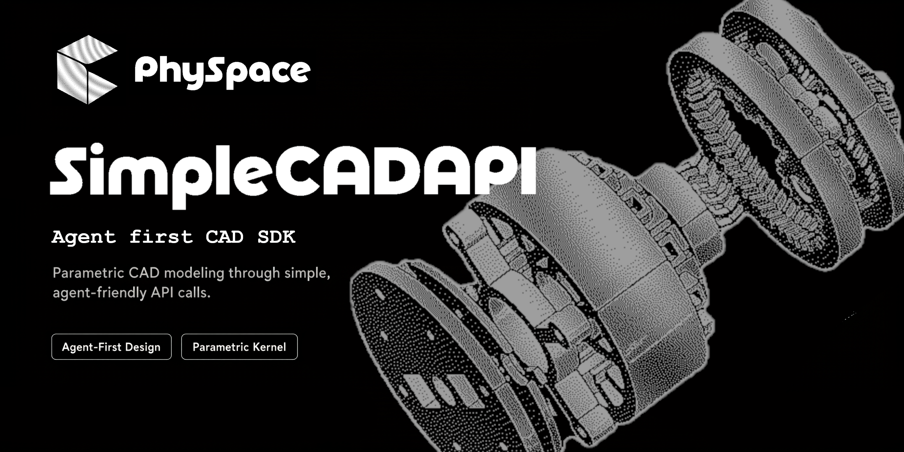

<p align="center">
  
</p>

# SimpleCADAPI

[中文说明](README.zh-CN.md)

---

<div align="center">
  <h2>CADDesigner Research Artifact</h2>
  <p>This repository is an artifact of</p>
  <p>
    <strong><a href="https://562590763.github.io/CADDesigner/">CADDesigner: Conceptual CAD Model Generation with a General-Purpose Agent</a></strong>
  </p>
  <p><strong>Accepted by <em>Computer-Aided Design</em>, 2026</strong></p>
</div>

---

SimpleCADAPI is an OCP-native Python SDK for building CAD models with clear,
functional operations and replayable model graphs. It wraps OpenCascade geometry
in a compact public API for creating solids, applying features, tagging semantic
intent, querying topology, exporting manufacturing files, and translating recorded
models into FreeCAD workflows.

Current beta: `simplecadapi==2.0.1b1`.

## What It Provides

- OCP-native shape types: `Vertex`, `Edge`, `Wire`, `Face`, and `Solid`.
- Functional modeling operations for primitives, profiles, extrude, revolve,
  loft, sweep, booleans, transforms, patterns, fillets, chamfers, and shells.
- Replayable modeling with `GraphSession`, `export_model_json(...)`,
  `import_model_json(...)`, and `replay_model_json(...)`.
- Expression parameters with `var(...)`, arithmetic expressions, and serialized
  expression graphs.
- QL selectors for geometry grounding, topology queries, and stable feature
  selections.
- Semantic tags through `apply_tag(shape, tag)` and `list_tags(shape)`.
- STEP/STL export and FreeCAD translation helpers for script or `.FCStd` output.

## Install

```bash
pip install simplecadapi
```

With `uv`:

```bash
uv add simplecadapi
```

For local development from this repository:

```bash
uv sync --group dev
```

## Quick Start

```python
from pathlib import Path

import simplecadapi as scad

out = Path("out")
out.mkdir(exist_ok=True)

base = scad.make_box_rsolid(60.0, 36.0, 8.0, bottom_face_center=(0.0, 0.0, 0.0))
hole = scad.make_cylinder_rsolid(5.0, 14.0, bottom_face_center=(0.0, 0.0, -3.0))
slot = scad.make_box_rsolid(18.0, 8.0, 14.0, bottom_face_center=(14.0, 0.0, -3.0))

part = scad.cut_rsolid(base, hole, slot)
boss = scad.make_cylinder_rsolid(8.0, 7.0, bottom_face_center=(-18.0, 0.0, 8.0))
part = scad.union_rsolid(part, boss)
part = scad.apply_tag(part, "role.demo.bracket")

print("volume", round(part.get_volume(), 3))
print("faces", len(part.get_faces()))
print("tags", scad.list_tags(part))

scad.export_step(part, str(out / "bracket.step"))
scad.export_stl(part, str(out / "bracket.stl"))
```

## Replayable Modeling

Use `GraphSession` when a model should be inspectable, serializable, replayable,
or translated into another CAD environment.

```python
import simplecadapi as scad
from simplecadapi import ql as Q

with scad.GraphSession() as session:
    body = scad.make_box_rsolid(40.0, 24.0, 10.0, bottom_face_center=(0.0, 0.0, 0.0))
    cutter = scad.make_cylinder_rsolid(4.0, 16.0, bottom_face_center=(0.0, 0.0, -3.0))
    drilled = scad.cut_rsolid(body, cutter)

    bottom_circle = (
        Q.edges()
        .where(Q.curve_type("circle"))
        .order_by(Q.center_axis("z"))
        .take(1)
        .exactly(1)
    )
    final = scad.chamfer_rsolid(drilled, bottom_circle, 0.6)

model_json = scad.export_model_json(session)
rebuilt = scad.replay_model_json(model_json)

print("recorded_nodes", session.graph.node_count)
print("replayed_outputs", len(rebuilt))
```

## Modeling Mental Model

- Start from design intent: reference axes, critical profiles, and the features
  that produce the final solid.
- Build from lower-dimensional geometry to higher-dimensional geometry: profile
  wires/faces first, then solid features such as extrude, revolve, loft, and
  sweep.
- Keep operations functional. Create new values with public functions such as
  `make_rectangle_rface(...)`, `extrude_rsolid(...)`, `cut_rsolid(...)`, and
  `fillet_rsolid(...)`.
- Use tags for semantic intent and selection anchors, for example
  `role.mounting.surface`, `anchor.datum.primary`, or `group.fasteners`.
- Store numeric and geometric facts in metadata or graph payloads, not in tags.
- Use QL to ground selections by geometry facts rather than relying on topology
  iteration order.
- When an indexed topology pick is intentional, pass the index to the plural
  child-geometry getter, such as `get_edges(index)`, `get_faces(index)`,
  `get_wires(index)`, or `get_vertices(index)`, so replayable graph workflows
  preserve the pick as a geo select node.
- Use model JSON as the interchange boundary for replay, tests, and FreeCAD
  translation.

## FreeCAD Translation

Recorded model JSON can be translated into a FreeCAD Python script:

```python
script = scad.translator.freecad_translator.translate_model_json_to_freecad_script(model_json)
```

If FreeCAD or FreeCADCmd is available, the same model JSON can be written as an
`.FCStd` file:

```python
scad.translator.freecad_translator.translate_model_json_to_fcstd(model_json, "bracket.FCStd")
```

Part/Assembly models are written as editable FreeCAD assembly structure: parts are
`App::Part`, assemblies are `Assembly::AssemblyObject`, and components are links.
Explicit compound projections remain available for geometry-only STEP export.

## Examples

Run examples from the source checkout:

```bash
uv run python examples/01_basic_modeling.py
uv run python examples/02_graph_replay.py
uv run python examples/03_expressions.py
uv run python examples/05_loft_sweep_revolve.py
uv run python examples/06_parametric_gear_model.py
uv run python examples/07_serialization_operation_tree.py
uv run python examples/08_constrained_sketch.py
uv run python examples/09_naca0016_blade_freecad.py
uv run python examples/10_part_assembly.py
```

## Documentation

- Public API reference: [`docs/api/`](docs/api/)
- Core type and modeling notes: [`docs/core/`](docs/core/)
- Serialization and replay details:
  [`docs/core/serialization/README.md`](docs/core/serialization/README.md)
- Operation graph JSON spec:
  [`docs/core/operation_graph_json_spec.md`](docs/core/operation_graph_json_spec.md)

## Releasing the Agent Skill

The repository includes a thin Agent Skill under `skills/simplecadapi/`. It
contains generated API and modeling references, but does not bundle the SDK
source code.

From a clean checkout, update the project version and documentation, then build
and validate the release artifacts:

```bash
uv sync --group dev
uv run skill-pack --refresh-docs --archive
uv run python -m pytest test/test_skill_pack.py
```

The command refreshes the generated docs, rewrites `skills/simplecadapi/`, and
creates `skills/simplecadapi.tar.gz`. Review the generated `SKILL.md` and
references before release:

```bash
git diff -- skills/simplecadapi docs
tar -tzf skills/simplecadapi.tar.gz
```

Commit the generated `skills/simplecadapi/` directory and refreshed `docs/`
with the release. The archive is intentionally ignored by Git; attach
`skills/simplecadapi.tar.gz` to the corresponding GitHub release or distribute
it through the target Agent Skills registry.

## Development

```bash
uv sync --group dev
uv run python -m pytest test tests
python3 -m compileall src/simplecadapi
```

## License

AGPL-3.0, see [`LICENSE`](LICENSE).

## Community

Join the CADDesigner technical community on WeChat:

<p align="center">
  
</p>
