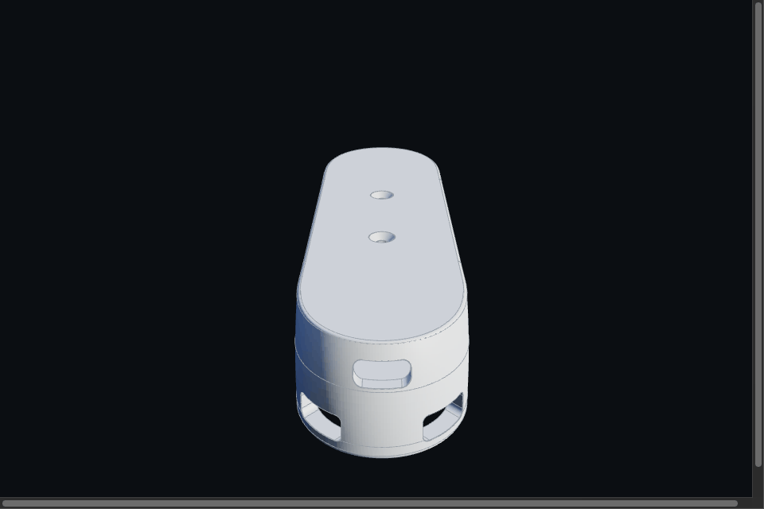
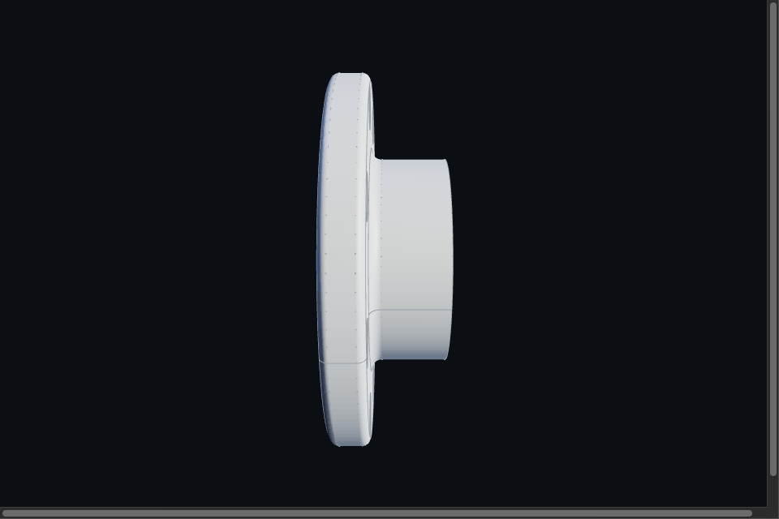
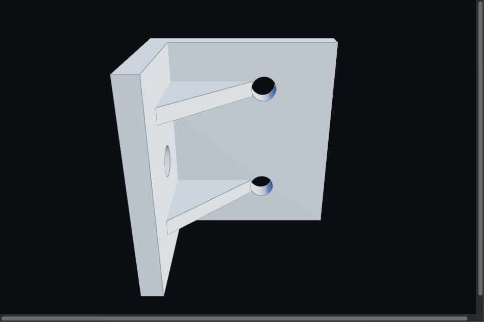
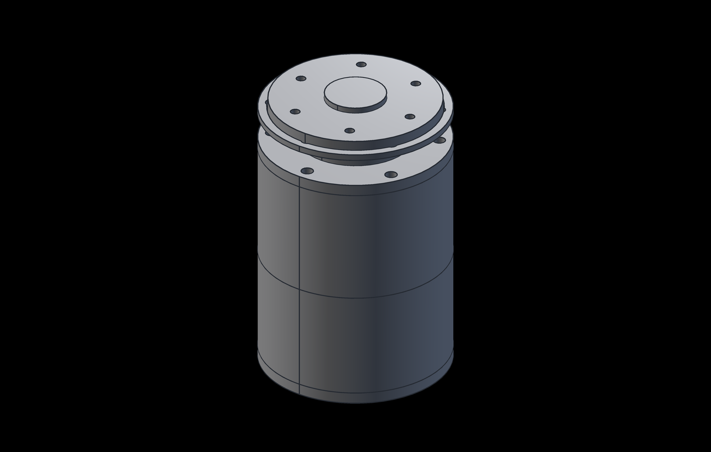
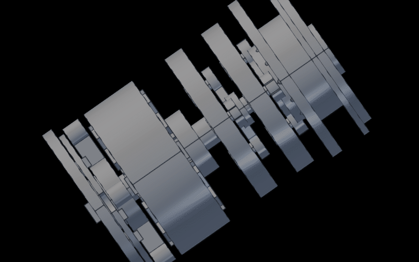
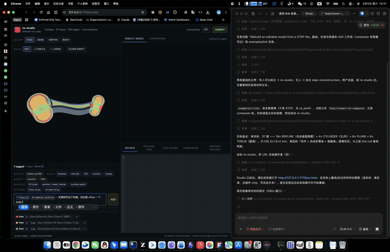
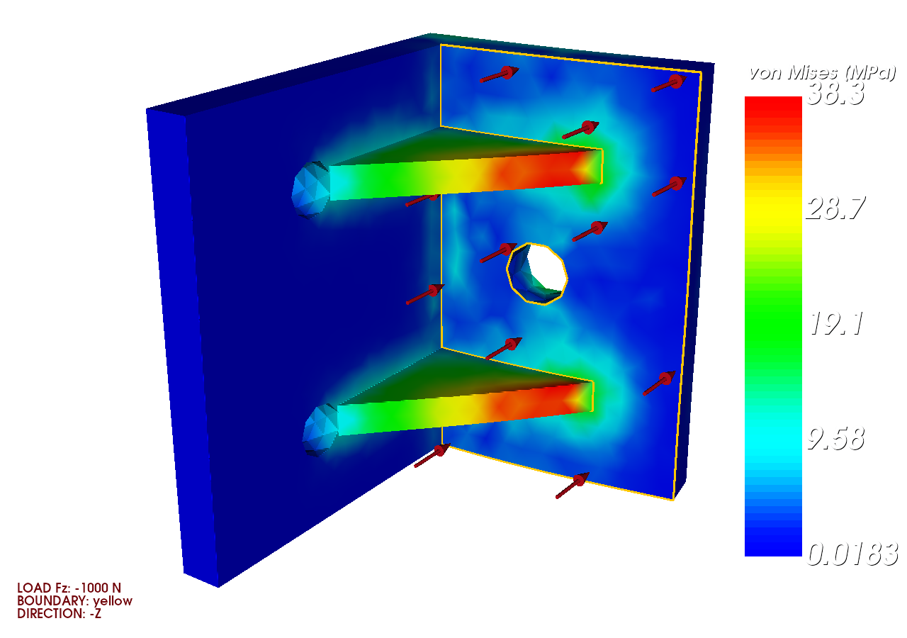
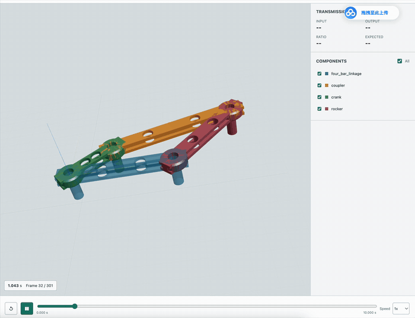
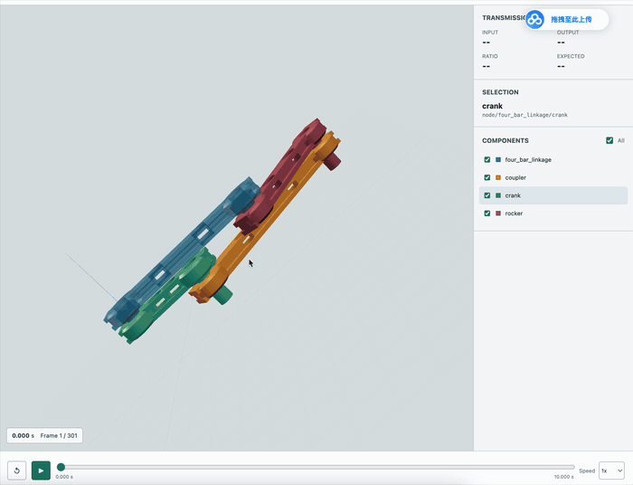

<p align="center">
  
</p>

# SimpleCADAPI

[English](README.md)

## 它能做什么

四块能力支柱。下面每个 case 都是**真实、可复现的会话**：回放 demo 是单文件离线
HTML，忠实回放完整录制的对话（用户输入、Agent 思考、每一次工具调用与补丁、角色
切换），旁边就是导出的 3D 模型 —— 浏览器直接打开即可。

### 1 · 单零件建模

以可读的[特征树规约](docs/skill/references/discipline/feature-tree-convention.md)
特征块编写参数化零件 —— 带单位的命名参数、验证先行的分阶段建模、改参后仍然命中的
确定性面标签，以及同步产出的 `.scadpkg` / STEP AP242 / STL / 可编辑 FreeCAD 工程。

<table>
<tr>
<th width="18%">案例</th>
<th width="40%">首轮需求（prompt 节选）</th>
<th width="42%">交付模型 · BRep 旋转展示</th>
</tr>
<tr>
<td><b>机械臂 U 形连杆 + 电机安装槽</b><br/>15 轮用户输入 · 601 次工具调用<br/><a href="examples/u_link_motor_mount/demo/index.html">▶ 完整会话回放</a></td>
<td>“构建参数化的机械臂连杆，能适应长度变化、通用安装电机：圆形 profile 沿『下 D → 右 L → 上 D』扫掠成 U 形；两侧圆珠 boolean cut 切出电机安装槽，安装面必须有确定命名、可被查询语言索引；底部圆柱切成半圆柱；然后全局倒角平滑。”</td>
<td></td>
</tr>
<tr>
<td><b>参数化法兰盘</b><br/>2 轮用户输入 · 66 次工具调用<br/><a href="examples/flange_plate/demo/index.html">▶ 完整会话回放</a></td>
<td>“参数化法兰盘：外径 100、厚 10、凸台 ⌀55 顶高 30、中心孔 ⌀30、6×⌀11 螺栓孔 @PCD 78、根部 R3 / 外缘 R2 圆角；所有尺寸走命名参数；每次圆角前打印选边卡；参数可行性守卫；一个 feature 一个块。”<br/><br/><i>GIF 为终态 8 孔 @PCD 84.5：第 2 轮改参 6→8 孔，PCD 88 被守卫当场拒绝、85 因圆角相切排除。</i></td>
<td></td>
</tr>
<tr>
<td><b>筋板 L 形支架（FEM 主模型）</b><br/>2 轮用户输入 · 49 次工具调用<br/><a href="examples/12_ap242_gmsh_volume_mesh/demo/index.html">▶ 完整会话回放</a></td>
<td>“把已有的 L 形直角连接件 legacy 脚本按 single-part-modeling 工作流正式化：FTC 特征块 + 命名参数重建；与旧版几何等价（体积偏差 &lt; 0.1%）；<code>interface.*</code> FEM 边界标签必须原样保留——下游 Gmsh/CalculiX 按标签选面。”</td>
<td></td>
</tr>
旋转展示由仓库内 [Scene Viewer](viewer/) 的 BRep 渲染器渲染（面着色 + 宽棱边），
一圈 = 48 个确定性方位角步进，经 `viewer/gif-harness.html` 驱动生成。

</table>

### 2 · 装配体建模

嵌套持久装配体 + 显式运动学：齿轮啮合、转动副、轴承接口都是被求解的约束，不是目测
摆放。标准件 —— 渐开线齿轮、带滚珠的轴承子装配、滚子链轮、真实牙型公制紧固件 ——
全部来自 `scad.std.*`，组合成机构后可导出 STEP、可编辑 FreeCAD 工程和面向物理引擎
的 MJCF。

<table>
<tr>
<td width="44%" align="center" valign="top">
<br/>
<b>一体化 BLDC 关节执行器</b> —— 装配态（影棚渲染）<br/>
29 个组件 · 51 条约束全部解算 · 两级行星减速 20:1
</td>
<td width="56%" align="center" valign="top">
<br/>
<b>同一模型</b> —— 爆炸旋转展示：四个模块（电调 · 电机 ·<br/>
双级减速器 · 输出轴）沿轴向分离，模块内同心零件按半径<br/>
分层剥离；相机沿倾斜圆轨道环绕
</td>
</tr>
</table>

复现方式：`uv run python examples/20_integrated_bldc_joint_actuator/main.py`
从零构建装配包；`render_showcase.py` 渲染上述视图；`export_all.py` 导出
STEP / 可编辑 FCStd / MJCF。

### 3 · 逆向工程

导入 STEP，在浏览器里检查 BREP，直接点选你关注的几何对象——每次点选都会以标签
形式落进标注输入框，旁边配上操作意图（sketch · boolean · fillet · 阵列…）和自由
备注。你的逆向思路挂在具体的面标签上，agent 收到的是被收窄的搜索空间，而不是从
零盲猜——人机协作全程录制、可回放。

<table>
<tr>
<td width="50%" align="center" valign="top">
<br/>
<b>re-studio MVP</b> —— 在 STEP 目标上点选面、逐条叠加操作意图与备注后提交；
agent 据此对连杆全部 37 个面做分类，从你的上下文出发开始重建 ·
<a href="img/capability/reverse_studio_mvp.mp4">▶ 完整视频</a>
</td>
</tr>
</table>

### 4 · 仿真插件

同一份参数化包直接喂给下游求解器，无需人工返工：AP242 STEP 进 Gmsh 体网格 +
CalculiX 静力 FEM（边界面按保真的 `interface.*` 标签选取，仿真链在模型改版后依然
成立），MJCF 进 MuJoCo 做机构动力学——仿真环境里的虚拟碰撞检查会暴露装配干涉，
驱动修正，直到机构全程干净运动。

<table>
<tr>
<td width="34%" align="center" valign="top" rowspan="2">
<br/>
<b>L 形支架静力 FEM</b> —— CalculiX von Mises 云图<br/>
经 Gmsh OpenCASCADE 内核从 AP242 导出体网格
</td>
<td width="33%" align="center" valign="top">
<br/>
<b>四连杆 + MuJoCo</b> —— 首次装配：连杆在运动中撞在一起，装配不对 ·
<a href="img/capability/fourbar_collision_before.mp4">▶ 完整视频</a>
</td>
</tr>
<tr>
<td width="33%" align="center" valign="top">
<br/>
<b>虚拟碰撞修正后</b> —— 同一仿真环境，修正后的装配全程干净运动 ·
<a href="img/capability/fourbar_collision_after.mp4">▶ 完整视频</a>
</td>
</tr>
</table>

---

## 更新日志（2.0.4b3 开发中）

> **Beta 版本：** 用于生产前，请验证生成的定义、装配约束和制造几何。

SimpleCADAPI 2.0.4b3 新增可复现的 `@part`/`@assemble` 产品边界、增量装配求解，
以及整零件的持久化崩溃安全缓存。契约、cache mode、诊断、限制和验证范围见
[完整中文更新说明](docs/updates/2.0.4b3.zh-CN.md)。

---

<div align="center">
  <h2>SimpleCADAPI 论文成果</h2>
  <p>本仓库是以下论文工作的项目产物：</p>
  <p>
    <strong><a href="https://arxiv.org/abs/2608.00891">CADIR: A Cross-Backend Editable Intermediate Representation for Agentic CAD Generation</a></strong>
  </p>
  <p><strong>Computer-Aided Design 2026 接收</strong></p>
</div>

---

SimpleCADAPI 是一个基于 OCP 的 Python CAD SDK，提供清晰的函数式建模操作和可重放的模型图。它在 OpenCascade 几何内核之上提供精简的公共 API，可用于创建实体、应用特征、添加语义标签、查询拓扑、导出制造文件，以及将记录的模型转换为 FreeCAD 工作流。

当前开发 Beta：`simplecadapi==2.0.4b3`。

## 核心能力

- 基于 OCP 的 `Vertex`、`Edge`、`Wire`、`Face` 和 `Solid` 类型。
- 支持基本体、轮廓、拉伸、旋转、放样、扫掠、布尔运算、变换、阵列、圆角、倒角和抽壳等函数式建模操作。
- 通过显式 `GraphSession`、`export_model_json(...)`、`import_model_json(...)` 和 `replay_model_json(...)` 记录并重放操作图。
- 通过 `var(...)`、算术表达式和可序列化表达式图定义参数。
- 使用 QL 选择器定位几何、查询拓扑并稳定选择特征。
- 通过 `apply_tag(shape=..., tag=...)` 和 `list_tags(shape=...)` 管理语义标签。
- 支持 STEP/STL 导出，以及 FreeCAD 脚本和 `.FCStd` 转换。
- 面向 Agent 的 STEP/BREP 逆向能力，提供稳定实体 ID、局部诊断、区域高亮截图和
  可测量的验收门槛。
- 可回放的开放/周期插值 B 样条 Edge 和 Wire，可用于自由轮廓与 Loft 截面。
- 持久 `@part`/`@assemble` 定义、增量装配求解，以及具备损坏隔离和 JSON 诊断的
  content-addressed cache。

## 安装

使用 pip：

```bash
pip install simplecadapi
```

使用 uv：

```bash
uv add simplecadapi
```

从本仓库进行本地开发：

```bash
uv sync --group dev
```

## 快速开始

```python
from pathlib import Path

import simplecadapi as scad

out = Path("out")

@scad.part(id="bracket")
def build_bracket() -> scad.Solid:
    base = scad.make_box_rsolid(
        width=60.0, height=36.0, depth=8.0, bottom_face_center=(0.0, 0.0, 0.0)
    )
    hole = scad.make_cylinder_rsolid(
        radius=5.0, height=14.0, bottom_face_center=(0.0, 0.0, -3.0)
    )
    body = scad.cut_rsolid(base, hole)
    return scad.apply_tag(shape=body, tag="role.demo.bracket")

result = build_bracket()
package_path = out / "bracket.scadpkg"
scad.capture(result, package_path)
print("volume", round(result.part.body.get_volume(), 3))
print("tags", scad.list_tags(shape=result.part.body))
scad.exporter.export_product_package_to_step(package_path, out / "bracket.step")
scad.exporter.export_product_package_to_stl(package_path, out / "bracket.stl")
scad.exporter.export_product_package_to_obj(package_path, out / "bracket.obj")
```


## 可重放操作图

几何流程需要检查、序列化、重放或转换到其他 CAD 环境时，请使用显式
`GraphSession`：

```python
import simplecadapi as scad
from simplecadapi import GraphSession, export_model_json, replay_model_json

with GraphSession(graph_id="drilled_block") as session:
    body = scad.make_box_rsolid(
        width=40.0, height=24.0, depth=10.0,
        bottom_face_center=(0.0, 0.0, 0.0),
    )
    cutter = scad.make_cylinder_rsolid(
        radius=4.0, height=16.0, bottom_face_center=(0.0, 0.0, -3.0)
    )
    drilled = scad.cut_rsolid(body, cutter)
    session.capture_result(value=drilled)
    model_json = export_model_json(session=session)
    recorded_nodes = session.graph.node_count

rebuilt = replay_model_json(json_str=model_json)
print("recorded_nodes", recorded_nodes)
print("replayed_outputs", len(rebuilt))
```

显式 `GraphSession` 在调用导出 API 前只存在于内存。需要持久 CAD/Viewer
交付物时，一个物理单实体零件使用 `@scad.part`，装配使用 `@scad.assemble`，
直接调用 `scad.capture(result, "out/product.scadpkg")`，一次完成捕获和写盘。
`.scadpkg` 包含完整定义闭包、求值场景、特征图、源码快照、拓扑以及渲染/选择资源。
STEP、STL、FCStd 和底层 JSON 仍由显式导出 API 生成。

## 持久产品构建与缓存

一个物理单实体零件使用 `@scad.part`；具有显式外部定义的装配使用
`@scad.assemble`。同 build key 的 PRT 在进程内直接复用，持久 part bundle 则跨运行复用未变 PRT。

```python
@scad.part(id="mounting_plate", cache="auto")
def build_plate(width: float = 30.0) -> scad.Part:
    body = scad.make_box_rsolid(width=width, height=20.0, depth=3.0)
    return scad.make_part_rpart(part_id="mounting_plate", body=body)

cold = build_plate()
warm = build_plate()
print(cold.cache_report.hit, warm.cache_report.hit)
```

缓存检查和维护命令输出稳定 JSON：

```bash
simplecad-cache status
simplecad-cache verify
simplecad-cache prune
```

cache mode、配置优先级、PRT 复用、增量失效、损坏修复和破坏性命令确认见
[持久缓存与产品构建工作流](docs/guides/cache-build-workflow.md)。

## STEP/BREP Agent 逆向

需要生成同步 STEP 视图或局部高亮截图时，请安装渲染依赖：

```bash
pip install "simplecadapi[inverse-engineer]"
```

专用命名空间 `simplecadapi.inverse_engineer.brep` 提供稳定的
Body/Face/Edge/Vertex ID，以及与 Agent 框架无关的工具注册表。逆向时应先读取
有界证据，只有在候选模型足够接近后，才执行成本较高的材料差集或严格拓扑检查：

```python
from simplecadapi.inverse_engineer import brep

schemas = brep.agent_tool_schemas()
summary = brep.call_agent_tool(
    name="get_model_summary",
    arguments={
        "model_path": "target.step",
        "include_parameter_groups": True,
    },
)
face = brep.call_agent_tool(
    name="inspect_entity",
    arguments={"model_path": "target.step", "entity_id": "face:0"},
)

print("tools", len(schemas))
print("faces", summary["face_count"])
print("carrier", face["geometry"]["type"])
```

CLI 使用同一份工具契约：

```bash
simplecad-brep tools
simplecad-brep tool get_model_summary --arguments-file summary-args.json
```

受控测试请使用 [Reconstruction Agent 测试规范](docs/guides/reconstruction-agent-test-prompt.md)，
完整证据、建模、回放和验收流程请阅读
[STEP BREP 逆向工程指南](docs/guides/step-brep-reverse-engineering.md)。

## FreeCAD 转换

外部 CAD 转换只接受经过验证的 `.scadpkg` 产品包：

```python
package_path = artifacts.artifact_paths["product"]
script = scad.translator.freecad_translator.translate_product_package_to_freecad_script(
    package_path
)
scad.translator.freecad_translator.translate_product_package_to_fcstd(
    package_path, "bracket.FCStd"
)
scad.exporter.export_product_package_to_step(package_path, "bracket.step")
scad.exporter.export_product_package_to_stl(package_path, "bracket.stl")
scad.exporter.export_product_package_to_obj(package_path, "bracket.obj")
```

STL 与 OBJ 共用 OpenCASCADE 对求值后 BREP 的直接三角化。两种格式包含相同的
定向三角面，不再需要可选 remeshing 依赖。曲面精度由 `linear_deflection` 和
`angular_deflection_degrees` 控制。

AP242/Gmsh 示例还包含可选 CalculiX FEM 流程。Python 侧依赖通过
`uv sync --extra fem` 安装；CalculiX 求解器需要单独安装（macOS：
`brew install costerwi/homebrew-calculix/calculix-ccx`）：

```bash
uv run --extra fem python examples/12_ap242_gmsh_volume_mesh/run_calculix.py \
  --ccx "$(brew --prefix calculix-ccx)/bin/ccx_2.23"
uv run --extra fem python examples/12_ap242_gmsh_volume_mesh/visualize_calculix.py
uv run --extra fem python examples/12_ap242_gmsh_volume_mesh/study_mesh_convergence.py \
  --ccx "$(brew --prefix calculix-ccx)/bin/ccx_2.23" \
  --linear-solver "ITERATIVE CHOLESKY" --solver-timeout 2400
```

分析统一使用 `mm`、`N`、`MPa`，输出 CalculiX `.inp`、`.dat`、`.frd`、求解日志、
摘要 JSON、ParaView `.vtu` 和位移放大后的 von Mises 云图 PNG。图中用黄色轮廓
标出载荷 physical group，并用红色 `-Z` 箭头表示载荷方向，不覆盖应力热力图。
收敛研究支持 `--resume`；失败的求解级别单独记录，不会混入数值序列。

仓库中的 `-1000 N` 研究从 `h=3.0 mm` 加密到 `h=0.25 mm`，共 11 级。平台要求
连续三组细化同时满足最大位移变化低于 `5%`、积分点峰值 von Mises 应力变化低于
`10%`。第 N 级验证网格为 `h=0.25 mm`（`0.0331843 mm`、`98.6392 MPa`），
因此生产计算推荐第 N-1 级 `h=0.27 mm`。细网格使用迭代 Cholesky；在
`h=0.375 mm` 同网格上与 SPOOLES 的位移和峰值应力差异均低于 `0.005%`，从而
绕过直接求解器的内存容量限制。

## 文档

- 2.0.4b3 更新说明：[`docs/updates/2.0.4b3.zh-CN.md`](docs/updates/2.0.4b3.zh-CN.md)
- Reconstruction Agent 测试规范：
  [`docs/guides/reconstruction-agent-test-prompt.md`](docs/guides/reconstruction-agent-test-prompt.md)
- STEP BREP 逆向工程指南：
  [`docs/guides/step-brep-reverse-engineering.md`](docs/guides/step-brep-reverse-engineering.md)
- 持久缓存与产品构建工作流：
  [`docs/guides/cache-build-workflow.md`](docs/guides/cache-build-workflow.md)
- 公共 API 参考：[`docs/api/`](docs/api/)
- 核心类型与建模说明：[`docs/core/`](docs/core/)
- 序列化与重放：[`docs/core/serialization/README.md`](docs/core/serialization/README.md)
- 操作图 JSON 规范：[`docs/core/operation_graph_json_spec.md`](docs/core/operation_graph_json_spec.md)
- 示例索引：[`examples/README.md`](examples/README.md)
  `.scadpkg` 产品包规范：[`design-docs/scadpkg-spec.md`](design-docs/scadpkg-spec.md)

## 发布 Agent Skill

仓库中的 `skills/simplecadapi/` 是精简版 Agent Skill。它包含生成的 API 和建模参考文档，但不包含 SDK 源代码。

在干净的工作区中更新项目版本和文档，然后生成并验证发布产物：

```bash
uv sync --group dev
uv run skill-pack --refresh-docs --archive
uv run python -m pytest test/test_skill_pack.py
```

该命令会刷新生成文档、重建 `skills/simplecadapi/`，并生成 `skills/simplecadapi.tar.gz`。发布前检查 Skill 内容和归档文件：

```bash
git diff -- skills/simplecadapi docs
tar -tzf skills/simplecadapi.tar.gz
```

发布时提交生成的 `skills/simplecadapi/` 目录和更新后的 `docs/`。归档文件已被 Git 忽略；请将 `skills/simplecadapi.tar.gz` 附加到对应的 GitHub Release，或上传到目标 Agent Skills 注册中心。

## 开发

```bash
uv sync --group dev
uv run python -m pytest test tests
python3 -m compileall src/simplecadapi
```

## 许可证

本项目采用 GNU Affero 通用公共许可证第 3 版（AGPL-3.0），详见 [`LICENSE`](LICENSE)。

## 社区交流

由于群聊人数过多，无法直接扫码入群。请扫描下方二维码添加杜鹏老师微信，由杜鹏老师邀请加入 CADDesigner 技术交流群：

<p align="center">
  
</p>
